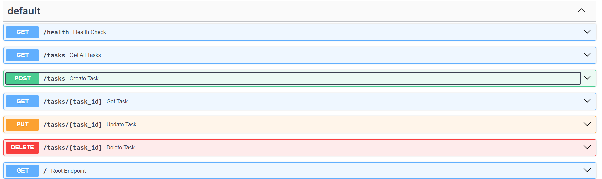
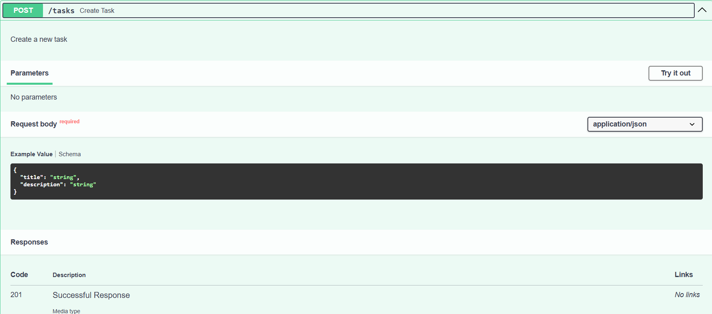

# FastAPI To-Do API
Simple to-do list manager API made in Python. Has the full CRUD functionalities.

## Features
- Create tasks (title, description)
- Read all tasks or a specific one
- Update any task´s field or all of them
- Delete a task
- Check the API´s health

## Installation

Clone the repo.

`git clone https://github.com/LaucoTec/fastapi-todo-api.git`

Install necessary dependencies.

> [!TIP]
> Create and activate a virtual environment before

`pip install -r requirements.txt`

## Running the API
Position yourself in the project´s folder and run

`uvicorn main:app`

>[!NOTE]
> `main` must be replaced with the filename and `app` with the variable inside the code.

## Endpoints
| Method | Endpoint | Description |
|--------|----------|-------------|
| GET | /health | Check API health |
| GET | /stats | See tasks statistics |
| GET | /tasks | Get all tasks |
| GET | /tasks/{task_id} | Get a task |
| POST | /tasks | Create a task |
| PUT | /tasks/{task_id} | Update a task |
| DELETE | /tasks/{task_id} | Delete a task |

## Request example
POSTing a new task:

```
curl.exe -X POST ^
  http://localhost:8000/tasks ^
  -H "Content-Type: application/json" ^
  -d "{\"title\":\"Buy eggs\",\"description\":\"Get a dozen\"}"
  ```

Response:

```
HTTP/1.1 201 Created
date: Sun, 26 Jul 2026 04:54:53 GMT
server: uvicorn
content-length: 73
content-type: application/json

{"id":5,"title":"Buy eggs","description":"Get a dozen","completed":false}
```

## Swagger Documentation



### Observaciones
Sin ningún archivo o base de datos donde guardar, cada que se reinicie el servidor se perderán todos los datos.